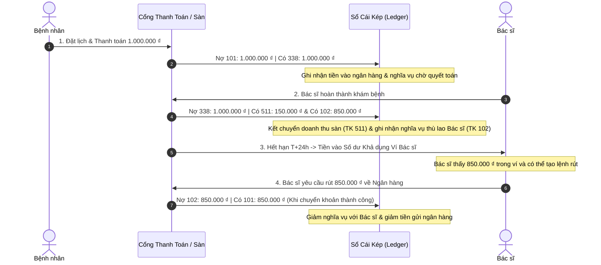
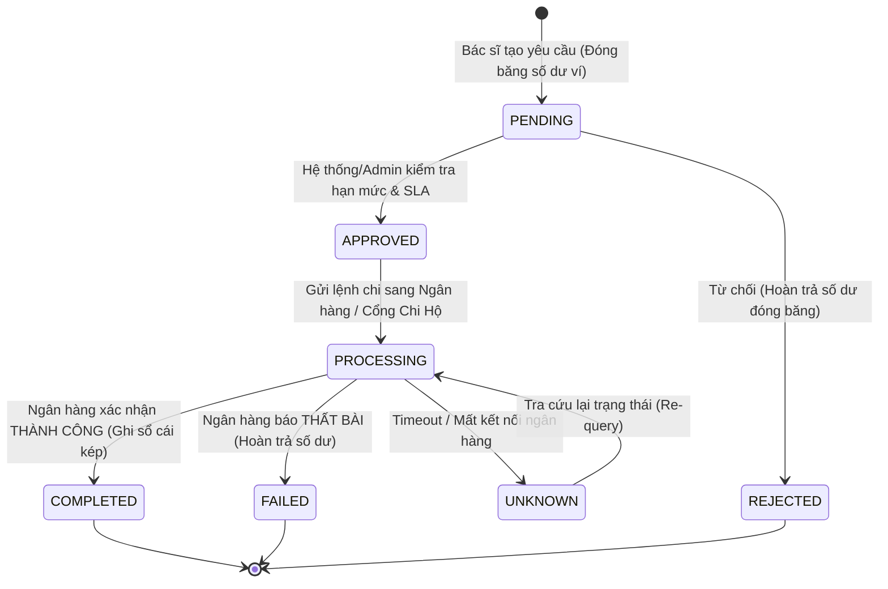

# CẨM NANG QUẢN TRỊ TÀI CHÍNH, SỔ CÁI KÉP & NGÂN QUỸ (ENTERPRISE TREASURY & FINANCIAL MANUAL)
### Dành cho Quản Trị Viên (System Admin), Giám Đốc Tài Chính (CFO) & Đội Ngũ Vận Hành BookingCare

---

## MỤC LỤC
1. [Nguyên Tắc Cốt Lõi: Chuyển Dịch Từ Vận Hành Thủ Công Sang Tự Động Hóa Có Giám Sát](#i-nguyên-tắc-cốt-lõi)
2. [Hệ Thống Tài Khoản Kế Toán Chuẩn & Sổ Cái Kép (Chart of Accounts)](#ii-hệ-thống-tài-khoản-kế-toán)
3. [Chu Trình Quyết Toán Thù Lao Bác Sĩ Tự Động & Kiểm Soát Tranh Chấp](#iii-quyết-toán-thù-lao-bác-sĩ)
4. [Chính Sách Phân Lập Môi Trường: Demo T+0 vs Vận Hành Production T+24h](#iv-chính-sách-phân-lập-demo-t0-vs-production)
5. [Quy Trình Rút Tiền Chuẩn Ngân Hàng (Withdrawal State Machine)](#v-quy-trình-rút-tiền-ngân-hàng)
6. [Cơ Chế Hoàn Tiền Bệnh Nhân: Ví Nội Bộ vs Cổng Thanh Toán Gốc](#vi-cơ-chế-hoàn-tiền-bệnh-nhân)
7. [Mô Hình Thanh Khoản LCR 7 Ngày & Quản Trị Ngân Quỹ Thực Tế](#vii-mô-hình-thanh-khoản-lcr-7-ngày)
8. [Financial Exception Hub: Trung Tâm Xử Lý Ngoại Lệ & Rủi Ro](#viii-financial-exception-hub)
9. [Ma Trận Phân Quyền Vận Hành (RACI Matrix)](#ix-ma-trận-phân-quyền-vận-hành)
10. [Sổ Tay Xử Lý Sự Cố Khẩn Cấp (Incident Runbooks & Reversal Entries)](#x-sổ-tay-xử-lý-sự-cố-khẩn-cấp)

---

## I. NGUYÊN TẮC CỐT LÕI

Mục tiêu chiến lược của hệ thống tài chính BookingCare là:
- **Tự động hóa giao dịch bình thường:** Mọi nghiệp vụ không có khiếu nại (bệnh nhân thanh toán, ca khám hoàn thành, hết thời hạn bảo lưu thù lao, hoàn tiền hủy lịch đúng hạn) được hệ thống tự tính toán, ghi sổ cái và cập nhật số dư tự động thông qua các worker nền có tính chất **Idempotent** (chống chạy trùng).
- **Admin chỉ giám sát và can thiệp ngoại lệ:** Admin không phải bấm tay phê duyệt từng ca khám hay đối soát thủ công hàng ngàn giao dịch mỗi ngày. Thay vào đó, Admin tập trung toàn bộ nguồn lực vào **Financial Exception Hub** để xử lý các bất thường (khiếu nại y tế, chậm SLA ngân hàng, áp lực thanh khoản hoặc mất cân đối sổ cái).
- **Sổ cái kép là Nguồn Chân Lý Duy Nhất (Single Source of Truth):** Số dư hiển thị trên ví bác sĩ hay ví bệnh nhân chỉ là một góc nhìn nghiệp vụ (view). Mọi quyền lợi, nghĩa vụ tài chính và đối soát pháp lý đều phải truy vết ngược về các dòng bút toán Nợ (Debit) và Có (Credit) bất biến trên Sổ cái.

---

## II. HỆ THỐNG TÀI KHOẢN KẾ TOÁN & BÚT TOÁN KÉP

### 1. Bảng Phân Loại Tài Khoản Kế Toán (Chart of Accounts)

| Mã TK | Tên Tài Khoản | Phân Loại Chuẩn | Ý Nghĩa Thực Tế & Ranh Giới Nghĩa Vụ |
| :--- | :--- | :--- | :--- |
| **101** | **Tiền gửi Ngân hàng & Cổng thanh toán (Cash & Bank Clearing)** | **Tài sản (Asset)** | Tổng tiền thực tế của nền tảng tại tài khoản ngân hàng doanh nghiệp và số dư đang chờ thanh toán bù trừ từ cổng VNPAY/MoMo. |
| **102** | **Phải trả Bác sĩ (Doctor Payables)** | **Nợ phải trả (Liability)** | Toàn bộ nghĩa vụ thù lao của BookingCare đối với Bác sĩ (bao gồm số dư thù lao khả dụng trong ví bác sĩ và các khoản đã hoàn tất khám đang chờ rút). |
| **103** | **Ví Bệnh nhân / Tiền cọc (Patient Wallet / Advances)** | **Nợ phải trả (Liability)** | Tiền đặt cọc trước hoặc số dư nạp sẵn của bệnh nhân mà sàn có nghĩa vụ cung ứng dịch vụ hoặc hoàn trả khi hủy hợp lệ. |
| **338** | **Phải trả Chờ quyết toán (Escrow & Pending Clearing)** | **Nợ phải trả (Liability)** | Tiền thu từ booking đang trong thời gian chờ khám hoặc đang trong thời hạn tạm giữ T+24h để phòng ngừa khiếu nại. **Tuyệt đối không cộng trùng với TK 102**. |
| **511** | **Doanh thu Dịch vụ Nền tảng (Platform Revenue)** | **Doanh thu (Revenue)** | Khoản phí hoa hồng (10% - 15%) mà sàn BookingCare được hưởng thực tế khi dịch vụ y tế hoàn tất. *(Lưu ý: Doanh thu không phải Vốn chủ sở hữu Equity)*. |

### 2. Vòng Đời Bút Toán Chuẩn (Ví dụ: Ca khám 1.000.000 ₫, Phí sàn 15%, Bác sĩ nhận 85%)



*Nguyên tắc bất biến:* Mọi giao dịch tài chính phát sinh đều đảm bảo $\sum \text{Debit} = \sum \text{Credit}$. Nếu xảy ra lệch dù chỉ 1 đồng, hệ thống kích hoạt ngoại lệ `LEDGER_IMBALANCE` ngay lập tức.

---

## III. QUYẾT TOÁN THÙ LAO BÁC SĨ: TỰ ĐỘNG HÓA & KIỂM SOÁT TRANH CHẤP

### 1. Luồng Tự Động Hóa Toàn Diện

```
[Ca khám Hoàn Tất (COMPLETED)]
       │
       ▼
Ghi nhận Doctor_Settlement_Item với Snapshot chính sách:
- Trạng thái ban đầu: EARNED (Tạm giữ)
- Thời hạn mở khóa: availableAt = now + HoldHours (Mặc định T+24h)
       │
       ▼
[Tác Vụ Nền Tự Động Quét Định Kỳ (Cron / Automation Worker)]
       │
       ├─► [Có Khiếu Nại Bệnh Nhân / Tranh Chấp Hoàn Tiền?]
       │         │
       │         └─► CÓ: Chuyển ngay sang [HELD (Đóng Băng Tạm Giữ)]
       │                 Đẩy vào Financial Exception Hub cho Admin đối soát y tế.
       │
       └─► KHÔNG: Hết thời gian giữ (availableAt <= now)?
                 │
                 ▼
          Chuyển sang [AVAILABLE (Sẵn Sàng Chi Trả)]
                 │
                 ▼
          Hệ thống TỰ ĐỘNG kết chuyển vào Ví Khả Dụng Bác sĩ
          + Ghi nhận Bút toán Sổ cái (Nợ 338 / Có 102).
          Admin KHÔNG CẦN bấm thủ công trong trường hợp bình thường.
```

### 2. Xử Lý Khi Có Khiếu Nại Y Khoa
- Nếu bệnh nhân gửi phản ánh chất lượng khám hoặc yêu cầu hoàn tiền, hệ thống tự động khóa ca khám liên quan sang trạng thái `HELD`.
- Thù lao bị giữ nguyên trong quỹ sàn, **không cho phép mở khóa tự động** cho đến khi:
  - Admin/Tổ y tế xác nhận giải quyết khiếu nại (bác sĩ không có lỗi $\rightarrow$ Mở khóa tiếp tục chi trả).
  - Hoặc phê duyệt hoàn tiền cho bệnh nhân $\rightarrow$ Hủy thù lao bác sĩ tương ứng (`CANCELLED`).

---

## IV. CHÍNH SÁCH PHÂN LẬP: DEMO T+0 VS PRODUCTION T+24H

Để đảm bảo vừa thuận tiện khi trình diễn sản phẩm (Demo/Testing) vừa tuyệt đối an toàn trên môi trường vận hành thực tế (Production):

| Tiêu Chí | Môi Trường Local / Demo | Môi Trường Production |
| :--- | :--- | :--- |
| **Thời gian giữ thù lao** | `T+0` (Mở khóa khả dụng ngay lập tức) | `T+24h` (Bắt buộc theo chuẩn bảo vệ người bệnh) |
| **Nút "⚡ Mở Khóa T+0 (Demo)"**| Hiển thị phục vụ báo cáo / demo tức thì | Bị vô hiệu hóa hoặc yêu cầu quyền Super Admin + Xác thực 2 bước |
| **Hiệu lực cấu hình** | Cho phép thử nghiệm linh hoạt | Cố định theo Quy chế Sàn TMĐT Y tế đã đăng ký |
| **Tính bất biến (Immutability)** | Cho phép reset dữ liệu thử nghiệm | Không áp dụng hồi tố. Ca khám phát sinh tại thời điểm nào sẽ mang `policySnapshot` và thời hạn giữ nguyên vẹn của thời điểm đó |

---

## V. QUY TRÌNH RÚT TIỀN NGÂN HÀNG (WITHDRAWAL STATE MACHINE)

Rút tiền là dòng tiền ra (Outflow) rủi ro nhất. Hệ thống BookingCare áp dụng **Máy trạng thái 5 bước nghiêm ngặt** nhằm chống rút âm ví và chống chuyển khoản trùng (Double-payout):



### Chi Tiết Từng Trạng Thái:
1. **`PENDING` (Chờ xử lý):** Tiền được trích từ `availableBalance` sang `reservedBalance` (đóng băng). Bác sĩ có thể hủy lệnh ở trạng thái này.
2. **`APPROVED` (Đã phê duyệt):** Thỏa mãn hạn mức rút tối đa/ngày, không có dấu hiệu gian lận.
3. **`PROCESSING` (Đang chuyển khoản):** Lệnh chi đã được chuyển đến đối tác ngân hàng. **Khóa tuyệt đối quyền hủy của Bác sĩ**.
4. **`COMPLETED` (Hoàn tất):** Đã có mã tham chiếu ngân hàng thực tế (`bankTransactionRef`). Ghi nhận bút toán Nợ TK 102 / Có TK 101.
5. **`FAILED` / `UNKNOWN` (Thất bại / Chưa rõ kết quả):**
   - **Quy tắc Vàng chống chuyển đúp:** Nếu lệnh chi bị timeout hoặc không nhận được phản hồi từ ngân hàng, **tuyệt đối không tạo lệnh chuyển khoản mới ngay lập tức**. Phải thực hiện quy trình tra cứu đối soát (Re-query) để xác nhận ngân hàng đã trừ tiền hay chưa trước khi xử lý tiếp.

---

## VI. CƠ CHẾ HOÀN TIỀN BỆNH NHÂN: VÍ NỘI BỘ VS CỔNG GỐC

BookingCare hỗ trợ 2 phương thức hoàn tiền minh bạch, được lưu vết trong `Refund_Case`:

| Phương Thức | Điều Kiện Áp Dụng | Thời Gian Nhận Tiền | Bút Toán Kế Toán |
| :--- | :--- | :--- | :--- |
| **Hoàn về Ví Nội Bộ (Internal Wallet)** | Áp dụng khi thanh toán ban đầu qua Ví hoặc bệnh nhân đồng ý nhận tiền tích lũy vào tài khoản BookingCare. | Tức thì ($< 1$ giây) | Nợ TK 338: Tiền chờ quyết toán<br>Có TK 103: Ví bệnh nhân |
| **Hoàn về Cổng Gốc (Gateway Reversal)** | Áp dụng cho các ca thanh toán qua Thẻ quốc tế (Visa/Mastercard) hoặc Cổng VNPAY. | 3 - 7 ngày làm việc (theo quy định của ngân hàng phát hành thẻ) | Nợ TK 338: Tiền chờ quyết toán<br>Có TK 101: Tiền gửi ngân hàng/Cổng |

*Lưu ý thẩm quyền:* Mọi điều chỉnh tăng giảm số tiền hoàn (`refundAmount`) so với tính toán tự động của hệ thống đều bắt buộc phải nhập **Lý do giải trình (Audit Reason)** và lưu vết người thao tác.

---

## VII. MÔ HÌNH THANH KHOẢN LCR 7 NGÀY & QUẢN TRỊ NGÂN QUỸ

Để đảm bảo BookingCare luôn có đủ tiền mặt chi trả cho Bác sĩ và hoàn tiền cho Bệnh nhân mà không bị mất cân đối dòng tiền, hệ thống sử dụng chỉ số **Hệ số Bao phủ Thanh khoản 7 Ngày (7-Day Liquidity Coverage Ratio - LCR 7D)**:

$$\text{LCR}_{7D} = \frac{\text{Nguồn tiền khả dụng trong 7 ngày}}{\text{Nghĩa vụ chi ròng dự kiến trong 7 ngày}} \times 100\%$$

### Trong đó:
- **Nguồn tiền khả dụng:** Tiền mặt tại quỹ ngân hàng sàn + Số dư chờ quyết toán từ cổng thanh toán đối soát trong vòng 24h - 48h.
- **Nghĩa vụ chi ròng 7 ngày:** Tổng dự kiến thù lao bác sĩ sẽ mở khóa trong 7 ngày + Hạn mức rút tiền dự báo + Tỷ lệ hoàn tiền dự kiến theo lịch sử.

### Thang Cảnh Báo An Toàn:
- $\text{LCR}_{7D} \ge 150\%$: **Vùng Xanh (An toàn tối đa)** — Tự động hóa chi trả vận hành bình thường.
- $100\% \le \text{LCR}_{7D} < 150\%$: **Vùng Vàng (Cảnh báo Thận trọng)** — Cảnh báo Admin, ưu tiên chi trả theo hạn mức và thứ tự SLA.
- $\text{LCR}_{7D} < 100\%$: **Vùng Đỏ (Kích hoạt Cầu chì An toàn - Circuit Breaker)** — Hệ thống tự động **tạm dừng các đợt chi trả lô tự động**. Toàn bộ lệnh rút giá trị lớn chuyển sang chế độ phê duyệt đặc biệt bởi CFO để điều tiết dòng tiền nạp bổ sung.

---

## VIII. FINANCIAL EXCEPTION HUB: TRUNG TÂM XỬ LÝ NGOẠI LỆ

Hệ thống gom tất cả các rủi ro vận hành vào bảng điều khiển tập trung (`/system/financial/exceptions`):

```
┌─────────────────────────────────────────────────────────────────────────────────┐
│ FINANCIAL EXCEPTION HUB (Trung Tâm Kiểm Soát Rủi Ro Tài Chính)                 │
├───────────────────┬──────────┬─────────────────────────────────────┬────────────┤
│ Mã Ngoại Lệ       │ Mức Độ   │ Nguyên Nhân & Dữ Liệu Đối Soát      │ Hành Động  │
├───────────────────┼──────────┼─────────────────────────────────────┼────────────┤
│ WD-202610-001     │ CRITICAL │ Rút tiền trễ SLA (< 2h còn lại)     │ Duyệt chi  │
│ ST-HELD-992       │ CRITICAL │ Bác sĩ bị khiếu nại chất lượng khám │ Xem hồ sơ  │
│ ALERT-LCR-BREAKER │ CRITICAL │ LCR sàn chạm ngưỡng 94% (< 100%)    │ Bơm quỹ    │
│ RF-DISPUTE-104    │ HIGH     │ Bệnh nhân yêu cầu hoàn 100% ngoài lệ│ Đối thoại  │
│ ST-OVERDUE-BATCH  │ NORMAL   │ 15 ca khám hết hạn T+24h chờ mở khóa│ Quét lô    │
└───────────────────┴──────────┴─────────────────────────────────────┴────────────┘
```

---

## IX. MA TRẬN PHÂN QUYỀN VẬN HÀNH (RACI MATRIX)

| Hành Động Tài Chính | Hệ Thống Tự Động | Admin Vận Hành (Ops) | Kế Toán / Treasury | Giám Đốc Tài Chính (CFO) |
| :--- | :---: | :---: | :---: | :---: |
| **Ghi nhận thù lao T+24h sạch** | **A / R** | I | I | I |
| **Mở khóa & Kết chuyển vào ví** | **A / R** | C | I | I |
| **Duyệt rút tiền thường (< 5 triệu)**| I | **A / R** | C | I |
| **Duyệt rút tiền lớn (>= 5 triệu)** | I | C | **R** | **A** |
| **Giải quyết khiếu nại y tế / HELD**| I | **R** | C | **A** |
| **Điều chỉnh tham số phí & T+0/T+24h**| I | I | C | **A / R** |
| **Xử lý Cầu chì Thanh khoản (LCR)** | **R** | I | C | **A** |

*(R: Responsible - Thực hiện; A: Accountable - Chịu trách nhiệm chính; C: Consulted - Tham vấn; I: Informed - Nhận thông báo)*

---

## X. SỔ TAY XỬ LÝ SỰ CỐ KHẨN CẤP (INCIDENT RUNBOOKS)

### 1. Sự Cố Webhook Thanh Toán Bị Lặp (Duplicate Webhook)
- **Triệu chứng:** Cổng thanh toán gửi nhiều callback cho cùng một mã giao dịch.
- **Cơ chế chống đỡ:** Mọi bút toán đều có `idempotencyKey` duy nhất gắn với mã giao dịch (`PAYMENT_{orderId}`). Lệnh gọi thứ 2 trở đi sẽ trả về HTTP 200 thành công ngay mà không tạo thêm giao dịch sổ cái.

### 2. Sự Cố Lệch Cân Đối Sổ Cái (Ledger Imbalance)
- **Triệu chứng:** Tổng Nợ $\neq$ Tổng Có trong bảng cân đối Sổ cái kép.
- **Hành động khẩn cấp:**
  1. Exception Hub tự động gắn cờ đỏ `CRITICAL`.
  2. Tạm khóa chức năng rút tiền toàn hệ thống để cô lập rủi ro.
  3. Kế toán trưởng tra cứu `referenceId` của bút toán không cân bằng trong **Nhật Ký Kiểm Toán (Audit Trail)**.
  4. Thực hiện **Bút toán Đảo (Reversal Entry)** có phê duyệt của CFO để triệt tiêu chênh lệch.

### 3. Sự Cố Ngân Hàng Timeout Khi Chuyển Khoản Rút Tiền
- **Triệu chứng:** Lệnh rút tiền ở trạng thái `PROCESSING` quá 30 phút mà không có kết quả từ ngân hàng.
- **Hành động khẩn cấp:**
  1. Không tạo thêm lệnh chi mới cho bác sĩ.
  2. Kế toán liên hệ đối tác ngân hàng/cổng chi hộ tra cứu mã giao dịch gốc.
  3. Nếu ngân hàng xác nhận tiền chưa ra khỏi tài khoản: Chuyển trạng thái về `FAILED` và nhả số dư đóng băng lại cho bác sĩ.
  4. Nếu ngân hàng xác nhận tiền đã trừ: Chuyển trạng thái sang `COMPLETED`, lưu mã ủy nhiệm chi và cập nhật sổ cái.

---
*Tài liệu được ban hành và áp dụng chính thức cho Hệ thống Y tế Số BookingCare.*
